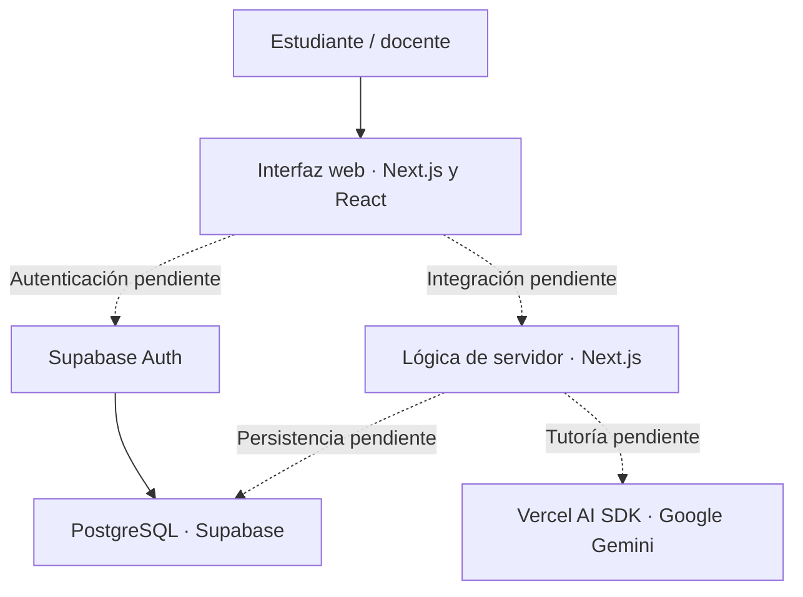

# MateSIMCE

Plataforma web en desarrollo para apoyar el aprendizaje de matemática de estudiantes de segundo medio en Chile y su preparación para el SIMCE. El proyecto contempla práctica de ejercicios, ensayos, seguimiento del progreso y un tutor con inteligencia artificial que entregue explicaciones, pistas y retroalimentación.

El objetivo es acompañar el razonamiento del estudiante y reforzar sus habilidades en números, geometría, álgebra y funciones, y estadística y probabilidades.

## Estado del proyecto

Actualmente están implementadas la página de presentación, la configuración inicial de la aplicación y la definición SQL de la base de datos. Las funcionalidades educativas descritas a continuación forman parte del diseño del producto y todavía requieren integración en la aplicación.

| Área | Estado actual |
| --- | --- |
| Interfaz | Página de presentación y componente reutilizable de botón. |
| Datos | Modelo SQL objetivo con 24 tablas, participantes seudónimos y sesiones temporales; pendiente de migrar la base existente. |
| Contenido inicial | Roles de usuario, curso de segundo medio y cuatro ejes temáticos. |
| Autenticación | Cuentas docentes en Supabase Auth y participantes con credenciales privadas; flujo de acceso pendiente. |
| Ejercicios y ensayos | Modelo de datos definido; pantallas y procesamiento de respuestas pendientes. |
| Tutor IA | Dependencias instaladas y modelo de conversaciones definido; integración con Gemini pendiente. |
| Progreso y recomendaciones | Tablas definidas; cálculo y visualización pendientes. |

Los archivos SQL describen la configuración prevista; su presencia en el repositorio no acredita que se hayan ejecutado en una instancia de Supabase.

## Arquitectura

La aplicación se organiza alrededor de Next.js con App Router. La interfaz y las futuras rutas del servidor se alojan en el mismo proyecto; Supabase proporciona la capa de autenticación y persistencia prevista, y Gemini será consumido desde el servidor mediante Vercel AI SDK.



El diagrama representa la arquitectura prevista. En esta etapa, la interfaz funciona como presentación estática y los servicios externos aún no están conectados.

### Modelo de datos

El [esquema de Supabase](mate-simce/supabase/schema.sql) organiza la información en los siguientes dominios:

| Dominio | Tablas |
| --- | --- |
| Cuentas docentes y contenidos | `roles`, `usuarios`, `cursos`, `temas` |
| Grupos y acceso | `grupos`, `participantes`, `credenciales_participante`, `actividades`, `actividades_ejercicios`, `sesiones_acceso` |
| Práctica | `ejercicios`, `soluciones_ejercicios` |
| Ensayos SIMCE | `ensayos_simce`, `preguntas_ensayo`, `soluciones_preguntas_ensayo`, `intentos_ensayo` |
| Aprendizaje | `respuestas_estudiante`, `pasos_resolucion`, `progreso_estudiante`, `retroalimentacion_ia` |
| Tutoría | `sesiones_tutor`, `mensajes_tutor` |
| Acompañamiento | `recomendaciones`, `notificaciones` |

El esquema habilita seguridad por filas (RLS) para cuentas de `profesor` y `administrador`. Los estudiantes se representan como participantes sin nombre, RUT ni correo; su historial permanece asociado al mismo identificador entre sesiones. Cada profesor consulta sus grupos. Credenciales, tokens y soluciones quedan reservados al servidor. El ingreso de participantes requiere rutas de servidor que todavía deben implementarse. Consulta el [modelo de sesiones](mate-simce/supabase/README.md).

## Stack tecnológico

Las versiones corresponden a lo declarado en [package.json](mate-simce/package.json).

| Capa | Tecnologías |
| --- | --- |
| Framework | Next.js 16.3.5 con App Router |
| Interfaz | React 19.2.8 y TypeScript 5 |
| Estilos | Tailwind CSS 4 |
| Componentes e iconos | shadcn/ui, Base UI y Lucide React |
| Autenticación y datos previstos | Supabase Auth, PostgreSQL, `@supabase/ssr` y `@supabase/supabase-js` |
| IA prevista | Vercel AI SDK 7 y proveedor Google Gemini |
| Notación matemática prevista | KaTeX y `react-katex` |
| Calidad de código | ESLint 9 y configuración de Next.js |
| Despliegue previsto | Vercel |

## Estructura del repositorio

```text
MateSIMCE/
├── README.md                 # Presentación general del proyecto
└── mate-simce/               # Aplicación Next.js
    ├── app/                  # Página principal, layout y estilos globales
    ├── components/ui/        # Componentes de interfaz
    ├── lib/                  # Utilidades compartidas
    ├── public/               # Recursos estáticos
    ├── supabase/
    │   ├── schema.sql        # Definición inicial de la base de datos
    │   └── seed.sql          # Roles, curso y temas iniciales
    ├── AGENTS.md             # Instrucciones para asistentes de desarrollo
    ├── README.md             # Documentación de la aplicación
    ├── LICENSE               # Licencia MIT
    ├── package.json          # Dependencias y scripts
    └── package-lock.json     # Versiones resueltas de dependencias
```

La raíz de Git es `MateSIMCE/`; los comandos de npm se ejecutan dentro de `mate-simce/`. Las carpetas de API, dashboard y tutoría se incorporarán cuando se implementen esos módulos.

## Desarrollo local

### Requisitos

- Node.js 20.9 o superior, según el requisito de Next.js instalado.
- npm 10 o superior.
- Proyecto de Supabase y credenciales de Gemini para las futuras integraciones.

### Instalación

Para una copia nueva del repositorio:

```bash
git clone https://github.com/Seba-IECI/MateSIMCE.git
cd MateSIMCE/mate-simce
npm ci
npm run dev
```

Si ya tienes el repositorio, entra en `mate-simce/` y ejecuta los dos últimos comandos. La aplicación estará disponible en [localhost:3000](http://localhost:3000).

### Variables de entorno

Para configurar las integraciones previstas, crea `mate-simce/.env` con tus propios valores:

```dotenv
NEXT_PUBLIC_SUPABASE_URL=https://your-project-ref.supabase.co
NEXT_PUBLIC_SUPABASE_ANON_KEY=your-supabase-anon-key
GEMINI_API_KEY=your-gemini-api-key
```

La página de presentación actual no consume estas variables. Las variables `NEXT_PUBLIC_*` están destinadas al cliente; `GEMINI_API_KEY` debe utilizarse únicamente desde el servidor. Una clave `service_role` de Supabase nunca debe exponerse en el navegador.

### Base de datos

En un proyecto nuevo de Supabase, ejecuta en el editor SQL, en este orden:

1. [schema.sql](mate-simce/supabase/schema.sql), para crear tablas, funciones, permisos y políticas.
2. [seed.sql](mate-simce/supabase/seed.sql), para cargar los roles, el curso y los temas.

El esquema está pensado para una base vacía, aborta si existe `usuarios` y no constituye una migración de tablas existentes. Las cuentas docentes deben provisionarse de forma administrativa; no se crean perfiles de alumno en Auth. Los datos iniciales todavía no incluyen ejercicios ni ensayos. Para la base actual, sigue el [plan de adaptación](mate-simce/supabase/README.md) antes de ejecutar cambios.

### Comandos disponibles

Ejecuta estos comandos desde `mate-simce/`:

| Comando | Propósito |
| --- | --- |
| `npm run dev` | Iniciar el servidor de desarrollo. |
| `npm run lint` | Revisar el código con ESLint. |
| `npm run build` | Generar la compilación de producción. |
| `npm run start` | Servir la compilación de producción. |

En PowerShell, si la política de ejecución bloquea `npm.ps1`, puedes usar `npm.cmd` para estos mismos comandos. Actualmente no hay un script de pruebas automatizadas definido.

## Despliegue

Para desplegar en Vercel, importa el repositorio y configura **Root Directory** como `mate-simce`. Define las variables de entorno en la configuración del proyecto cuando se activen las integraciones correspondientes.

## Convenciones de desarrollo

- Mantener `package.json` y `package-lock.json` versionados para reproducir la instalación.
- Excluir credenciales, `node_modules/`, `.next/` y artefactos generados mediante el `.gitignore` de la aplicación.
- Leer [AGENTS.md](mate-simce/AGENTS.md) antes de modificar la aplicación.
- Documentar las nuevas funcionalidades y diferenciar lo implementado de lo planificado.
- Ejecutar las verificaciones pertinentes antes de proponer cambios.

## Próximos hitos

- Integrar registro, inicio de sesión y perfiles de usuario.
- Implementar práctica de ejercicios y ensayos con corrección en el servidor.
- Conectar el tutor IA y almacenar el historial de las sesiones.
- Calcular y mostrar progreso, retroalimentación y recomendaciones.
- Incorporar gestión de contenido para docentes y administradores.

## Licencia

El proyecto se distribuye bajo la [licencia MIT](mate-simce/LICENSE).
